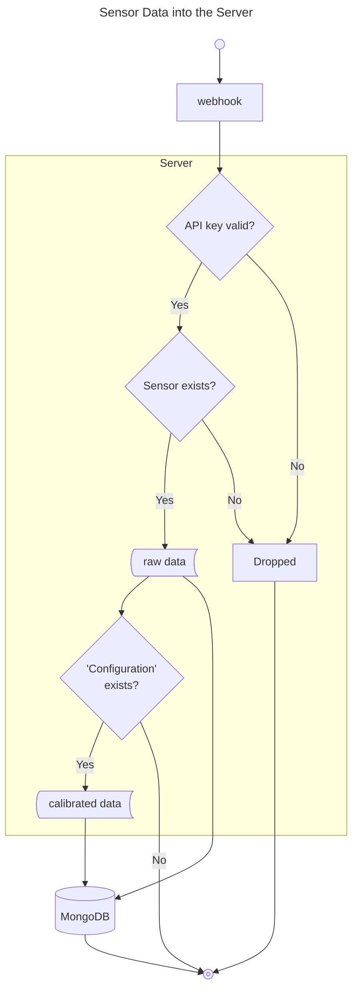

# mini-farm-tracker

Basic overview:
Provide a visualisation platform for various LoRaWAN sensors.
Initial design is required to track available water in water tanks.

MVP:

- [x] Raw data (from LoRaWAN nodes) propagate through the system and are saved.
- [?] This raw data is able to be queried from and displayed via graphs
- [ ] Configurations per sensors are able to be created; these are responsible to determine how the raw data is to be modified as then stored as calibrated data. These are to have "starting" times to all the sensor to be re-installed.
  - [ ] While for the MVP I want configurations to affect incoming data, the actual creation of these configurations should be behind a authentication. This can be V2.
- [ ] This calibrated data is also to be able to be viewed via the website
- [ ] User is able to re-calibrate the data; this will take all the raw data and apply all the calibrations created for the sensor.

## website

Using NodeJS v22.13.0

## server

Using Golang

Primary motivation is I have done similar in Python multiple times (Flask, Quart) and while I have created microservices within Golang, I have not used it for web API hosting.

# Diagrams

## Data Flow of data into the system



# Devices

## gateway - LPS8v2 Indoor LoRaWAN Multichannel Gateway

## Water tank - water levels - Dragino LDDS45

[Decoder](https://github.com/dragino/dragino-end-node-decoder)

[Dropbox](https://www.dropbox.com/scl/fo/ehbyykfvqb549beg69nly/AGksttCIAr55scX6QxXg4RA?rlkey=crbquiode216okgxrqleck654&e=1&dl=0)

[User Manual](https://wiki.dragino.com/xwiki/bin/view/Main/User%20Manual%20for%20LoRaWAN%20End%20Nodes/LDDS45%20-%20LoRaWAN%20Distance%20Detection%20Sensor%20User%20Manual/)

### Decoder

When adding the device within TTN there was no need to add the decoder manually as the end device was able to be added from with the lorawan device repository.

## Weather sensor - S2120 

[Purchase Location](https://www.iot-store.com.au/products/sensecap-s2120-lorawn-weather-station)

[Guide](https://cdn.shopify.com/s/files/1/1386/3791/files/SenseCAP_S2120_LoRaWAN_8-in-1_Weather_Station_User_Guide.pdf?v=1662178525)

[Ignore decoder within guide](https://github.com/Seeed-Solution/TTN-Payload-Decoder/blob/master/README.md)

Should have looked here first:
[Online Guide](https://wiki.seeedstudio.com/Getting_Started_with_SenseCAP_S2120_8-in-1_LoRaWAN_Weather_Sensor/)
[Actual decoder](https://github.com/Seeed-Solution/SenseCAP-Decoder/tree/main/S2120/TTN)
Copied for testing purposes within server directory `ttnDecoders`.

### Decoder

The end device was required to be added manually.

By default the format of the decoder looks like:

```json
{
    "err": 0,
    "messages": [
        [
            {
                "measurementId": "4097",
                "measurementValue": 30.8,
                "type": "Air Temperature"
            },
            {
                "measurementId": "4098",
                "measurementValue": 44,
                "type": "Air Humidity"
            },
            {
                "measurementId": "4099",
                "measurementValue": 114488,
                "type": "Light Intensity"
            },
            {
                "measurementId": "4190",
                "measurementValue": 8.8,
                "type": "UV Index"
            },
            {
                "measurementId": "4105",
                "measurementValue": 1.2,
                "type": "Wind Speed"
            }
        ],
        [
            {
                "measurementId": "4104",
                "measurementValue": 54,
                "type": "Wind Direction Sensor"
            },
            {
                "measurementId": "4113",
                "measurementValue": 0,
                "type": "Rain Gauge"
            },
            {
                "measurementId": "4101",
                "measurementValue": 99190,
                "type": "Barometric Pressure"
            }
        ],
        [
            {
                "measurementId": "4191",
                "measurementValue": 3,
                "type": " Peak Wind Gust"
            },
            {
                "measurementId": "4213",
                "measurementValue": 0,
                "type": "Rain Accumulation"
            }
        ]
    ],
    "payload": "4A01342C0001BF3858000C4B00360000000026BF4C001E00000000",
    "valid": true
}
```

The structure of nested messages arrays are somewhat irrigating to parse.
Minor code modification was performed to "flatter" the resulting array.

```json
{
    "err": 0,
    "payload": "4A01342C0001BF3858000C4B00360000000026BF4C001E00000000",
    "valid": true,
    "messages": [
      {
        "measurementValue": 30.8,
        "measurementId": "4097",
        "type": "Air Temperature"
      },
      {
        "measurementValue": 44,
        "measurementId": "4098",
        "type": "Air Humidity"
      },
      {
        "measurementValue": 114488,
        "measurementId": "4099",
        "type": "Light Intensity"
      },
      {
        "measurementValue": 8.8,
        "measurementId": "4190",
        "type": "UV Index"
      },
      {
        "measurementValue": 1.2,
        "measurementId": "4105",
        "type": "Wind Speed"
      },
      {
        "measurementValue": 54,
        "measurementId": "4104",
        "type": "Wind Direction Sensor"
      },
      {
        "measurementValue": 0,
        "measurementId": "4113",
        "type": "Rain Gauge"
      },
      {
        "measurementValue": 99190,
        "measurementId": "4101",
        "type": "Barometric Pressure"
      },
      {
        "measurementValue": 3,
        "measurementId": "4191",
        "type": " Peak Wind Gust"
      },
      {
        "measurementValue": 0,
        "measurementId": "4213",
        "type": "Rain Accumulation"
      }
    ]
}
```

This allows for simplied parsing without all loss of useful information for my purposes.
(I do not benefit for the separation of data collection from each internal 8-in-1 sensor)

## Mongo

### Indices
Both `RawData` and `CalibratedData` schemas within MongoDB are configured as timeseries collections.
Both use `sensor` and `timestamp` as compound indexes and are intended to function as covering indexes for all associated queries.

### mongosh

View timeseries information

```mongosh
db.runCommand({
  listCollections: 1,
  filter: { name: "raw_data" }
})
```

```mongosh
db.runCommand({
  listCollections: 1,
  filter: { name: "raw_data" }
}).cursor.firstBatch[0]
```

```mongosh
db.runCommand({
  listCollections: 1,
  filter: { name: "calibrated_data" }
})
```

```mongosh
db.runCommand({
  listCollections: 1,
  filter: { name: "calibrated_data" }
}).cursor.firstBatch[0]
```

# Hosting

## WebUI

Hosted on: <b>[vercel](https://vercel.com)</b>

vercel CLI is used to deploy when required.

### Environment variables

Once updated via the vercel dashboard, it is important to pull them locally.

This will pull the "production" environment fields to test local development against the production server.
> vercel env pull --environment=production .env.production

From here can use the vercel deploy steps within the `package.json` file.

## Server

built in: [gin-gonic](https://gin-gonic.com/)

Hosted on: <b>DigitalOcean</b>

Domain established within DigitalOcean directing to droplet:
`mini-farm-tracker.io`

DNS Records are configured within DigitalOcean to allow for vercel website to be sued.

## Weather

https://openweathermap.org/price


### Development

#### WebUI

Allow for asset generation
> npm install -g @vue/cli

> vue generate component MyComponent

#### Server

> git checkout .
> git clean -fd

> go build
> export GIN_MODE=release && ./mini-farm-tracker-server

#### Network

Firewall options - inbound port of 3000 (TCP) required

SSL certificate (Let's Encrypt) created on domain bought from namecheap.

### Testing

#### testContainer (currently only implemented for server - mongoDB)

NOTE: testContainer can use cloud resources however prefer to run locally.

#### TODO

#### Test result generation

##### Server

> go test ./... -coverprofile=coverage.out
> go tool cover -html coverage -o coverage.html

Requires:
- Docker Desktop
- [testContainer](https://app.testcontainers.cloud/accounts/14403/dashboard/install?target=windows-desktop)

With my environment, I have problems with the embedded testContainers cleanup logic.

Following [configuration path](https://golang.testcontainers.org/features/configuration/) adding a line to disable `ryuk` allows correct running:

> ryuk.disabled=true

# Rough TODO

Considersations.
* I want a cron-style periodic tasks which to handle aggregating sensor data.
  * I want a common task/worker pool supported functionality.
  * I want these actions to be "sync'd" between multiple instances of the application (currently we have 2 running hosted with DigitalOcean), only want each task to be handled by pod of either of the pods, with the tasks being picked up by each pod.
    * I use the term "pod", even though thats not a DigitalOcean specific term.

### WebUI

- [] Graphs
  - Initial HW will allow for 2 sensors; one for each tank.
- [ ] V2 will have auth, although as part of the purpose of this is a demo project, putting it behind a auth "wall" is counter productive initially.

### Server

- [x] Investigate HTTP servers - SSL secured and CORs established
  - Currently implmented with [gin](https://github.com/gin-gonic/gin)
- [x] Investigate Containerisation options.
  - Initial version is simply running binary.
  - solutions such as k8/docker (compose) are viable however k8 atleast is likely an overkill. All I want really want is crash/restart tolerance.
  - [x] For now a solution found using the App Platform within DigitalOcean. Allows:
    - [x] Health endpoints
    - [x] HA (defaults to 2x containers)
    - [x] Auto-deploy from git commit
    - [x] Automatic handling of SSLs.

### General

- [x] Connect MongoDB
  - [x] Account Created
  - The ideal is to try the Timeseries support. Historically not been MongoDB strong suite but have never personally tried it and apparently improved in v8.
  - [x] Schema definitions - Primary outlined in the `schema.go` file.
    - [ ] Not all defined - enough for E2E functionality to be possible

- [x] Connect The Things Stack
  - [x] Account Created
  - Hardware provided
  - [x] Gateway
  - [x] 2x ultrasonic sensors to measure depth in tanks.
